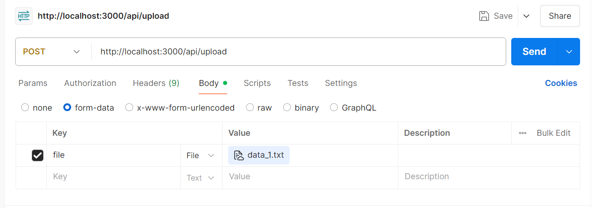
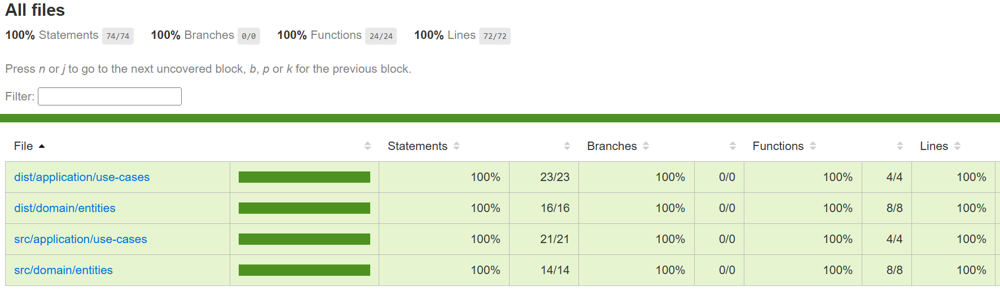

# Desafio Técnico - LuizaLabs Vertical Logística

## Descrição

Este projeto resolve o desafio técnico da LuizaLabs para a vertical de logística, processando arquivos de pedidos em formato texto legado, normalizando os dados e expondo uma API REST para upload, consulta e filtragem dos pedidos.

---

## Tecnologias Utilizadas
- Node.js
- TypeScript
- Express
- TypeORM
- SQLite
- Jest (testes)
- Clean Architecture

---

## Como rodar o projeto

1. **Clone o repositório:**
   ```bash
   git clone <url-do-repo>
   cd desafio-luizalabs-vertical-logistica
   ```
2. **Instale as dependências:**
   ```bash
   npm install
   ```
3. **Compile o projeto:**
   ```bash
   npm run build
   ```
4. **Inicie a aplicação:**
   ```bash
   npm start
   ```
   Ou, para desenvolvimento:
   ```bash
   npm run dev
   ```

A API estará disponível em `http://localhost:3000`.

---

## Endpoints da API

### 1. Upload de arquivo

**POST** `/api/upload`
- Envie um arquivo `.txt` no campo `file` (form-data).
- Apenas um arquivo por vez.

**Exemplo de resposta (sucesso):**
```json
{ "message": "TXT file processed successfully" }
```
**Exemplo de erro:**
```json
{ "error": "No file uploaded" }
{ "error": "Uploaded file is empty" }
{ "error": "Only one file can be uploaded at a time." }
```

### 2. Consulta de pedidos
**GET** `/api/orders`
- Parâmetros opcionais:
  - `order_id` (número)
  - `start_date` (YYYY-MM-DD)
  - `end_date` (YYYY-MM-DD)

**Exemplo de resposta:**
```json
[
  {
    "user_id": 1,
    "name": "Zarelli",
    "orders": [
      {
        "order_id": 123,
        "total": "1024.48",
        "date": "2021-12-01",
        "products": [
          { "product_id": 111, "value": "512.24" },
          { "product_id": 122, "value": "512.24" }
        ]
      }
    ]
  }
]
```
**Exemplo de erro:**
```json
{ "error": "order_id must be a number" }
{ "error": "start_date must be a valid date (YYYY-MM-DD)" }
{ "error": "end_date must be a valid date (YYYY-MM-DD)" }
```
---

## Testes
- Para rodar os testes unitários:
  ```bash
  npm test
  ```
- Para ver a cobertura:
  ```bash
  npm run test:coverage
  ```

---

## Linting e Formatação
- Para verificar problemas de código:
  ```bash
  npm run lint
  ```
- Para corrigir automaticamente problemas de formatação:
  ```bash
  npm run lint:fix
  ```

O projeto utiliza ESLint com as seguintes configurações:
- TypeScript 5.3.3 (compatível com @typescript-eslint)
- Regras de estilo e boas práticas
- Formatação consistente do código
- Detecção de problemas comuns

---

**Coverage**

Os testes principais estão sendo 100% cobertos pela aplicação.



---

## Banco de Dados

- O projeto utiliza **SQLite** como banco de dados, que é leve e não requer instalação manual.
- O arquivo do banco é criado automaticamente na primeira execução, em:
  ```
  src/infrastructure/database/config/database.sqlite
  ```

### Consultando o banco

Você pode visualizar ou consultar os dados usando ferramentas como:
- [DB Browser for SQLite](https://sqlitebrowser.org/)
- [DBeaver](https://dbeaver.io/)
- Ou via terminal:
  ```bash
  sqlite3 src/infrastructure/database/config/database.sqlite
  ```

> **Obs:** Não é necessário instalar o SQLite manualmente, pois o driver já está incluído nas dependências do projeto. Para visualizar o arquivo. É necessário executar o comando **npm run build** primeiramente, para criar o database. Após isso é somente prosseguir com a inserção do arquivo(upload) e o banco de dados criará as tabelas de forma automática.

---

### Estrutura

A tabela principal é `orders`, onde ficam armazenados os pedidos processados a partir dos arquivos `.txt` enviados. 

---

## Decisões técnicas e diferenciais
- **Arquitetura limpa:** Separação clara entre camadas (domain, application, infrastructure), mantendo também a metodologia SOLID.
- **Persistência:** Utiliza SQLite para facilitar testes e portabilidade.
- **Batch insert:** Processamento eficiente de grandes arquivos.
- **Validação e tratamento de erros:** Mensagens claras e status HTTP adequados, seguindo a arquitetura RESTful. 
- **Testes unitários:** Cobrem as principais regras de negócio.
- **Documentação clara:** README com exemplos e instruções.

---

## Observações
- O upload aceita apenas um arquivo `.txt` por vez.
- Os filtros de busca são opcionais e podem ser combinados.
- O projeto pode ser facilmente adaptado para outros bancos ou persistências.

---

**Desenvolvido por Davi Toledo Mattos para o desafio técnico LuizaLabs.**